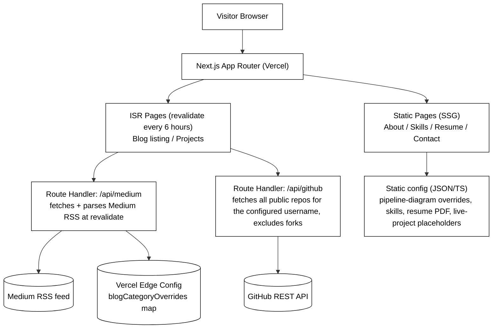

# Portfolio Website — Design Spec

**Date:** 2026-08-11
**Status:** Approved by user, pending spec review sign-off

## Purpose & Audience

A personal portfolio website whose primary goal is landing job interviews (recruiters/hiring managers as primary audience), for a backend/data/ML engineer. It aggregates:

- Blog posts written on Medium, grouped by category
- GitHub repos, pulled automatically from the owner's account
- A "live projects" section (currently empty — placeholder for future deployed projects)
- A downloadable resume
- Contact links

## Stack Decision

**Next.js (App Router) on Vercel.**

Considered and rejected:
- **Astro on Vercel/Netlify** — leaner by default, but smaller ecosystem for the interactive features (command palette, animated diagrams) this project wants, and a less common stack for future collaboration.
- **Plain Vite + React SPA** — simplest, but Medium's RSS feed doesn't support CORS, so client-side fetching would still need a proxy/serverless function anyway, while losing SSG's SEO and performance benefits.

**No traditional database.** All content resolves to one of:
- Static config (TypeScript/JSON) committed to the repo — skills, optional per-repo pipeline-diagram overrides, resume file reference, live-project placeholders, contact links
- Server-side fetch at ISR revalidation — Medium RSS (blog posts), GitHub REST API (all public repos for the configured username, live)
- Vercel Edge Config — a free, first-party key-value config store (not a general-purpose database) holding an optional per-post blog category override map, editable from the Vercel dashboard with no redeploy

## Architecture

- Pages are pre-rendered (SSG) and cached; ISR pages quietly re-fetch in the background every 6 hours, so visitors always get a fast static response, never a live fetch waterfall.
- Route handlers are serverless functions included free on Vercel — not a persistent backend, not a database.
- The Medium route handler additionally reads an optional `blogCategoryOverrides` map from Vercel Edge Config; when a post's URL has an entry, it replaces that post's Medium tags for filtering purposes. This is the only piece of dynamic, editable-outside-of-code state in the whole site.
- Hosting cost: $0 on Vercel's free (Hobby) tier at personal-portfolio traffic scale, including Edge Config's free tier.

## Visual Direction

- Dark-by-default, with a light/dark toggle.
- Monochrome palette + single accent color.
- Technical/monospace-influenced typography (fits the command-palette and pipeline-diagram features, and the backend/ML audience).
- Minimal motion — subtle transitions, not heavy animation, consistent with reference sites researched (Jack Jeznach, Tamal Sen style minimalism) rather than SaaS-bright/gradient-heavy design.

## Site Structure & Content

| Section | Content | Source |
|---|---|---|
| Hero / About | Name, role, one-line pitch, links (GitHub/LinkedIn/Medium/email) | Static config |
| Skills | Interactive tech-stack visual, grouped (Languages, Data, ML, Infra) | Static config |
| Blog | Medium posts, categorized by Medium tags with optional per-post overrides, filterable | Medium RSS (ISR) + Edge Config overrides |
| Projects (GitHub) | All public repos (forks excluded, sorted by stars) with GitHub's own description + live stats (stars, last updated, language); a few repos may have a hand-authored pipeline diagram override | GitHub API (ISR) + optional static pipeline-override config |
| Live Projects | "Coming soon" placeholder cards now; real project cards added as shipped | Static config |
| Resume | Download button (PDF) | Static file in `/public` |
| Contact | mailto: link + social icons, no form | Static config |

### Cool features (in scope for v1)

1. **Interactive skills visual** — categorized grid/graph (Languages → Data → ML → Infra) with hover states, not a generic progress-bar list.
2. **Animated architecture/pipeline diagrams** — for a small, hand-picked set of repos (via an optional static override config keyed by repo slug — most auto-pulled repos have none and simply don't show a diagram), a small SVG diagram (e.g. `Kafka → Spark → S3 → Redshift`) that animates on scroll/hover within that project's card — shows real system-design work rather than telling.
3. **Command palette (Cmd+K)** — jump to any section, open resume, or go to a project via keyboard (`cmdk` library).

### GitHub project sourcing

Repos are pulled live from the GitHub REST API for a single configured username (`config/site.ts`'s `githubUsername`), not curated by hand — forks are excluded (they aren't original work), remaining repos are sorted by star count, and each project's write-up is GitHub's own repo `description` field rather than a hand-authored blurb. This was chosen over a curated allow-list so new repos appear automatically with no code change. The one piece of hand-authored content that survives is the pipeline-diagram visual (see "Cool features" above): a small static config maps a handful of repo slugs to a diagram, and every other repo simply renders without one.

### Blog categorization

Categories default to whatever tags a post already has on Medium (up to 5 tags/post, pulled from the RSS feed's `<category>` fields). An optional `blogCategoryOverrides` map in Vercel Edge Config — `{ "<medium-post-url>": "<category>" }` — lets a specific post's category be corrected or set explicitly, editable from the Vercel dashboard at any time with no code change or redeploy. This was chosen over a full database (Neon/Supabase) because the actual need is a small, infrequently-written, read-heavy map — exactly what Edge Config is built for — and over a committed config file because it avoids a redeploy per category change while staying free and effectively zero-maintenance.

### Explicitly out of scope for v1

- Contact form (mailto + social links only — avoids needing a form-handling service)
- Any relational/document database or persistent backend (Edge Config is a key-value config store, not a general-purpose database)
- E2E test framework (Playwright can be added later if the site grows)

## Error Handling

- Medium RSS fetch failure/empty feed → blog section shows a graceful "posts temporarily unavailable" state; last successfully cached ISR result is served if one exists, rather than breaking the page.
- GitHub repo list fetch failure (rate limit, network error) → the projects page shows a graceful "projects temporarily unavailable" state, mirroring the blog page's fallback, rather than a broken page.
- Edge Config read failure or missing `blogCategoryOverrides` key → treated as an empty override map; posts fall back to their Medium tags, never a broken page.
- All external fetches (RSS parse, GitHub API, Edge Config) have a timeout, try/catch, and typed fallback (empty array/object) — never an unhandled crash.

## Testing (TDD)

- Data-layer units are the primary TDD targets: Medium RSS parser (XML → typed post objects, category extraction), GitHub fetch/normalize function, and the Edge Config override reader + apply function are pure-ish functions — tests written first (Vitest), covering happy path, empty feed, malformed XML, API error/rate-limit cases, and missing/failed Edge Config reads.
- UI components with real logic get React Testing Library coverage: command palette filtering/keyboard nav, skills-visual grouping, blog category filtering.
- Purely presentational components (hero, footer) don't need dedicated tests.
- No E2E framework for v1.

## Deployment

- Vercel project connected to a GitHub repo; auto-deploy on push to `main`, preview deployments on PRs/branches.
- Custom domain pointed at Vercel if/when available; otherwise the free `*.vercel.app` subdomain.
