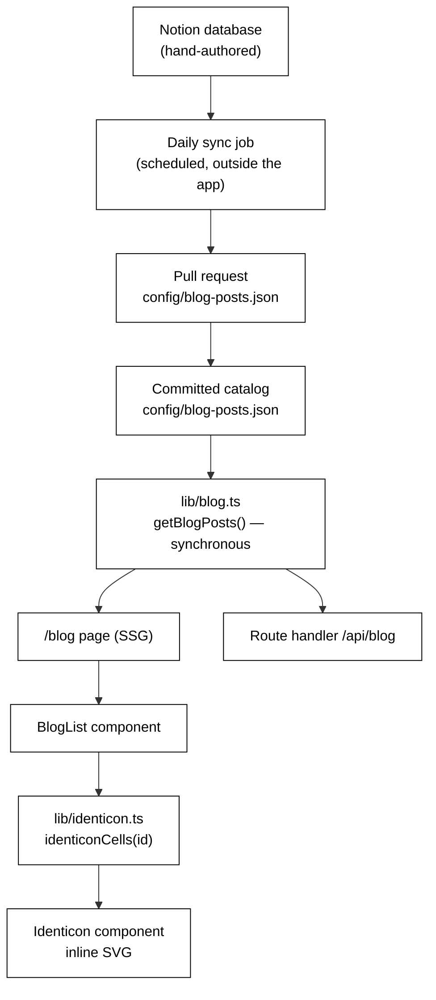

# Blog Catalog from Notion — Design Spec

**Date:** 2026-08-13
**Status:** Approved by user, pending spec review sign-off
**Supersedes:** the blog-post portions of `2026-08-11-portfolio-website-design.md` (Medium RSS as the runtime blog source, and `config/blog-categories.json` as a URL-keyed category map)

## Purpose

Replace Medium's RSS feed with a committed JSON catalog generated from a Notion database, so the blog page can show every published post rather than the ten most recent, and so blog cards carry a generated visual identity instead of a scraped cover image.

## Problem

Two defects motivated this, both found while wiring Notion up:

1. **Medium's RSS feed returns exactly 10 items.** Verified directly against `https://medium.com/feed/@nadeem4-nk13`. The catalog holds 92 published posts, so the blog page could only ever render about 11% of the writing. Because the filter chips are derived from the posts actually loaded, nine of the twelve categories never appear on the site at all — the entire Postgres, Python Logging, Azure, and Java runs are invisible, along with every post older than the last ten.

2. **`config/blog-categories.json` shipped empty (`{}`).** The plumbing from PR #7 landed but was never populated, so `applyBlogCategories` fell through to `Uncategorized` for every post in production.

The first defect is structural: no amount of category data fixes a source that caps at ten rows. That is what makes replacing the source, rather than filling in the file, the right move.

## Source of Truth

The Notion database `📰 Blog Catalog — All Published Posts` is authored by hand and is the upstream authority. A daily sync job regenerates `config/blog-posts.json` and opens a pull request; the committed JSON is what the site builds against.

Medium is removed from the runtime entirely. Nothing is fetched from it at build or request time.

This resolves an earlier tension in the design. While RSS supplied title, URL, date and snippet at runtime, putting those fields in the config would have created two sources for the same fact. Once RSS is gone, the JSON is the only supplier, so carrying those fields is correct rather than duplicative.

## Architecture



The sync job is deliberately outside the application. The app only ever reads a committed file, which keeps the build hermetic and makes the site independent of both Notion and Medium at runtime.

## Data Contract

`config/blog-posts.json` is an array, sorted newest-first:

```json
[
  {
    "id": "bdb4bd9cf398",
    "title": "How Kafka Really Works",
    "subtitle": "Lessons from a 60M+ events/day production pipeline",
    "url": "https://medium.com/learnwithnk/kafka-under-the-hood-the-architecture-secrets-that-make-it-scale-bdb4bd9cf398",
    "date": "2026-02-06",
    "category": "Backend & Infra"
  }
]
```

**Ordering is `date` descending, ties broken by `id` ascending.** Twenty-five posts share a publication date with at least one other, spread across ten dates — four of them land on `2024-09-16` alone. Without an explicit tie-break the sync job could emit a different ordering each run, producing phantom diffs in the daily pull request.

| Field | Source column | Notes |
|---|---|---|
| `id` | Post ID | Trailing hex from the Medium URL. Stable across slug rewrites and publication moves. Also the identicon seed. |
| `title` | Title | |
| `subtitle` | Subtitle | Hand-written; replaces Medium's auto-extracted snippet. |
| `url` | Medium URL | |
| `date` | Published Date | ISO `YYYY-MM-DD`. |
| `category` | Category | Exactly one per post. The Notion schema defines 14 options; 12 are currently in use. |

**Why an array rather than an object keyed by id.** The page renders in this order, so no runtime sort is needed, and a newly published post is a single clean hunk at the top of the diff — which matters because a bot writes this file daily and a human reviews it. Id uniqueness is enforced by a test rather than by the data structure.

**Why `id` and not the URL as identity.** Medium rewrites slugs when a title changes. The catalog already contains a live example: "How Kafka Really Works" still sits at `.../kafka-under-the-hood-the-architecture-secrets-that-make-it-scale-bdb4bd9cf398`. Posts are also spread across three publications (`@nadeem4-nk13`, `learnwithnk`, `dev-genius`). The hex id survives both; the URL does not.

## Blog Card Visuals

Cover images were previously scraped from the RSS payload by `extractFirstImageUrl`. With RSS gone there is no image source, and Notion has no cover-image column. Rather than reintroduce a dependency or ask for 92 hand-pasted URLs, each post gets a **deterministic identicon generated from its id**.

**Style:** a 7×7 bitfield grid, horizontally symmetric, drawn as squared-off cells so it reads as a terminal glyph rather than an avatar. Chosen over an oscilloscope-trace and a box-drawing-character variant after visual comparison of all three against real post ids.

**Module split**, so the generative logic is testable without React:

- `lib/identicon.ts` — `identiconCells(id: string): boolean[][]`. A seeded PRNG over the hex id fills the left four columns of a 7×7 grid, then mirrors them. Pure: no DOM, no JSX, no randomness beyond the seed.
- `components/blog/identicon.tsx` — receives the grid, emits `<rect>` elements.

The SVG uses `fill="currentColor"`, so it inherits the amber accent and adapts to the existing `.light` theme without a second palette.

## File-Level Changes

| Action | File |
|---|---|
| new | `config/blog-posts.json` — 92 entries |
| new | `lib/identicon.ts` |
| new | `components/blog/identicon.tsx` |
| rewrite | `lib/blog.ts` — returns the catalog; no longer `async`, no fetch |
| edit | `components/blog/blog-list.tsx` — identicon replaces ``; renders subtitle and date |
| edit | `components/blog/filter-posts.ts` — `categories: string[]` becomes `category: string` |
| edit | `config/site.ts` — remove the now-unused `mediumFeedUrl` |
| rename | `app/api/medium/route.ts` → `app/api/blog/route.ts`, serving the catalog |
| delete | `lib/medium.ts`, `lib/medium.types.ts`, `lib/blog-categories.ts`, `config/blog-categories.json`, and their tests |

`rss-parser` is removed from `package.json`; `lib/medium.ts` was its only consumer.

The list stays a flat `<ul>` rendering all 92 posts. The existing category chips become the real navigation; no pagination or grouping is added.

## Error Handling

The current runtime failure mode is removed rather than handled. `fetchMediumPosts` swallows every failure into `catch { return [] }`, so a feed outage silently renders an empty blog page in production. A committed JSON imported at build time turns a malformed catalog into a **build failure**, which cannot reach production.

Two guards remain:

- `identiconCells` must never throw on a short, empty, or non-hex id. It falls back to a fixed seed and still returns a valid grid.
- `BlogList`'s existing empty-state message is kept as a cheap backstop.

## Testing

Test-driven, per project convention.

**`lib/identicon.ts`**
- same id produces an identical grid across repeated calls
- different ids produce different grids, checked across real catalog ids
- output is horizontally symmetric
- a golden snapshot for one known id, so the generated art cannot silently change under refactor
- empty, short, and non-hex ids return a valid grid without throwing

**`config/blog-posts.json`** (via `lib/blog.ts`)
- ids are unique and match `^[0-9a-f]{6,}$`
- every entry has all six required fields, non-empty
- entries are sorted by `date` descending with ties broken by `id` ascending
- every `category` is one of the **14** options defined in the Notion schema, not merely the 12 currently in use — `RAG on PDFs` and `LLM-Era System Design Case Studies` have no posts yet, and validating against the in-use set would fail the first time either is assigned

**`components/blog/blog-list.tsx`**
- renders every post in the catalog
- selecting a category chip narrows the list correctly
- an identicon is rendered for each post
- subtitle and date appear on the card

**Removed:** all RSS parsing tests, alongside `lib/medium.ts`.

## Out of Scope

- **The daily sync job itself.** This spec covers the consuming side only. The job that reads Notion, regenerates the JSON, and opens the PR is a follow-up, and is blocked on the claude.ai routines API, which returned `401` throughout this session. A headless run cannot rely on the interactive Notion MCP OAuth used here; it will need a Notion internal integration token supplied as a secret.
- **Review context in the committed file.** Human-readable context about what changed belongs in the sync job's pull request body, not in the artifact.
- **Cover images.** Deliberately dropped in favour of generated identicons.
- **Pagination, grouping, and search** on the blog page.
