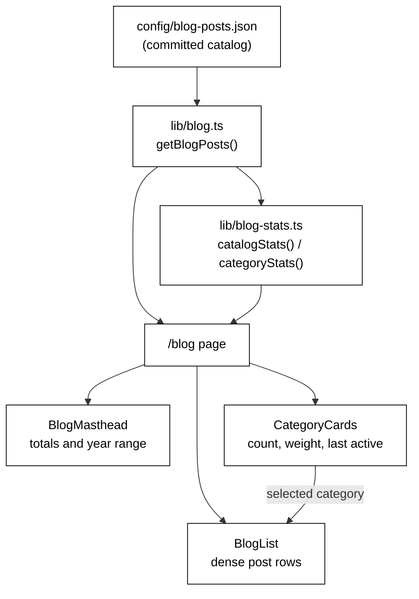

# Blog Page — Depth Signal Redesign

**Date:** 2026-08-13
**Status:** Approved by user, pending spec review sign-off
**Depends on:** `2026-08-13-blog-catalog-from-notion-design.md` — needs `subtitle`, `date`, and `category`, which exist only in the Notion-sourced catalog

## Purpose

Make `/blog` communicate the scale and range of six years of writing within the first ten seconds of landing, for a recruiter or hiring manager who will not read a post.

The page currently renders 92 posts as an undifferentiated flat list behind a row of alphabetical filter chips. Every post is present, but nothing states that there *are* 92 of them, spanning 12 domains, since 2020. The evidence is on the page without being legible.

## Why Not Cards For Posts

The obvious reading of "high visibility" is bigger post cards. That is the wrong instrument for this goal.

Cards are a browsing-and-selection pattern: they add padding so an individual item can be evaluated. That directly trades away density. Ninety-two posts rendered as cards show four per screen instead of ten, and paradoxically *read as less writing* than the same posts rendered densely. Terminals are good at precisely the property this page needs — high information density that reads as substance.

So cards are used where grouping and relative weight are the message (categories), and rejected where volume is the message (posts). This was validated by rendering all three variants against real data before choosing.

## The Category Weighting Problem

Category sizes are severely uneven, and size does not track importance:

| Category | Posts | Last active |
|---|---:|---|
| Vector Databases | 6 | Aug 2026 |
| AI System Design | 19 | Jul 2026 |
| System Design Case Studies | 3 | Jul 2026 |
| J-Space Primer | 4 | Jul 2026 |
| Postgres Series | 10 | Jul 2026 |
| AI Breakthroughs | 2 | Jul 2026 |
| Backend & Infra | 5 | Feb 2026 |
| LLM Architectures | 6 | Jan 2026 |
| Azure Functions Internals | 3 | Jun 2025 |
| Python Logging | 6 | Jun 2025 |
| Azure & Cloud Fundamentals | 17 | Sep 2024 |
| Java & Spring Boot | 11 | Sep 2024 |

The second-largest category, Azure & Cloud Fundamentals, last saw a post in September 2024 and is the least representative of the author's current work. Vector Databases and LLM Architectures are small but current, and align with how the profile describes the author.

**Ordering is therefore by most recent post, descending.** Alphabetical ordering carries no information. Ordering by count leads with the stalest material. Ordering by recency surfaces current focus and — critically — is *derived*, so it stays correct as the sync job adds posts, with no list for anyone to maintain or forget.

Post count is still shown, as a number and as a bar relative to the largest category, so volume remains visible without dictating position.

## Architecture

Nothing new is fetched or stored. Every figure is derived from the existing catalog at build time. The catalog schema does not change, so the sync job is unaffected.

## Components

Split so the derivation logic is testable without React.

**`lib/blog-stats.ts`** — pure, no DOM and no JSX.

- `categoryStats(posts): CategoryStat[]` → `{ category, count, latest, earliest }`, sorted by `latest` descending, ties broken by `category` ascending. The tie-break is not hypothetical: Azure & Cloud Fundamentals and Java & Spring Boot both last saw a post on `2024-09-16`. Without it, those two cards could swap between builds. (Five categories share July 2026 as their last-active *month*, but their exact dates differ, so they order deterministically on the date alone.)
- `catalogStats(posts): CatalogStats | null` → `{ total, categoryCount, firstYear, lastYear }`, or `null` for an empty catalog so the masthead can render nothing.

**`components/blog/blog-masthead.tsx`** — renders the summary line. Renders nothing when the catalog is empty, rather than `0 POSTS · 0 DOMAINS`.

**`components/blog/category-cards.tsx`** — replaces the chip row. One card per category showing name, count, a weight bar whose width is `count / highestCount` across the catalog, and the month of its most recent post (for example `Aug 2026`). Owns the selected-category UI; selection state stays lifted in `BlogList`.

**`components/blog/blog-list.tsx`** — row restyle only. Identicon drops from 80px to 34px; category and date move into a single meta line beneath the subtitle.

`getCategories` is **removed** from `filter-posts.ts`. Category ordering is now by recency, which is a derived-statistic concern rather than a filtering one, and lives in `blog-stats.ts`. `filterPostsByCategory` stays where it is.

## Interaction

Clicking a category card filters the list in place and marks that card active; clicking it again clears the filter. This preserves current behaviour — the cards are a restyling of the chips, not a new mechanism.

The masthead always reflects the **whole catalog**, not the active filter. Its job is stating total scale; recomputing it on filter would undercut that.

## Error Handling

Small by construction. The catalog is committed and validated at build time, and categories are derived from posts rather than declared, so a category with zero posts cannot exist and a weight bar can never divide by zero on a non-empty catalog.

Two cases remain:

- Empty catalog — `BlogMasthead` renders nothing; `BlogList` keeps its existing fallback message.
- `categoryStats([])` returns an empty array rather than throwing.

## Testing

Test-driven, per project convention.

**`lib/blog-stats.ts`**
- per-category counts match the catalog
- ordering is by `latest` descending, with ties broken by category name
- `earliest` and `latest` bound each category correctly
- `catalogStats` year range spans the true first and last post
- both functions accept `[]` and return empty results without throwing

**`components/blog/category-cards.tsx`**
- renders one card per category in the catalog
- shows each count
- clicking selects and filters; clicking the selected card clears it
- the active card is marked with `aria-pressed`

**`components/blog/blog-masthead.tsx`**
- figures are asserted against values derived from the catalog, never against literals, so the test cannot rot as posts are added
- renders nothing for an empty catalog

**`components/blog/blog-list.tsx`**
- existing behaviour holds: renders every post, filters, links to Medium, shows subtitle and date

## Out of Scope

- **Category routes** (`/blog/vector-databases`). Worth real SEO value and shareable links, but that is twelve pages and a routing change — its own piece of work, not part of a card redesign.
- **Pagination, grouping, and search.** The flat list of all 92 posts is retained deliberately; density is the point.
- **Changes to the catalog schema or the sync job.** This design is purely derivative of data that already exists.
