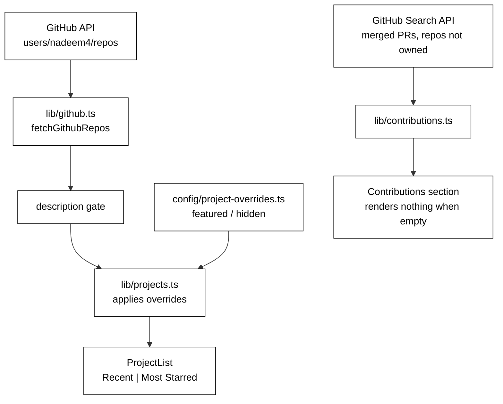

# Projects Page — Curation and Open-Source Contributions

**Date:** 2026-08-13
**Status:** Approved by user, pending spec review sign-off

## Purpose

Make `/projects` lead with work that supports the site's goal of landing senior engineering interviews, and give open-source contributions a place to appear once they exist.

## Problem

The page selects repos by commit count: `lib/github.ts` hides anything with fewer than three commits. Commit count measures *how* someone worked, not whether the work is good, and the results show it:

| Hidden by the filter | | Shown by the filter | |
|---|---:|---|---:|
| `mini-gpt` — GPT-style transformer in pure PyTorch | 1 | `hackerrank` — practice problems | 7 |
| `changelog` — LLM-driven changelog tool | 1 | `code_gladiator_2020` — two contest answers | 4 |
| `career_forge_ai` | 2 | `nutrient_detector` — ~45 PDFs, no code | 3 |
| `ai_logger` | 1 | `rain_in_austrailia_kaggle` | 5 |

A focused project squashed into one commit scores worse than a folder of contest solutions. Roughly five of the nineteen currently visible repos carry senior-level signal.

**This is a curation problem, not a visual one.** Note the contrast with the blog: there, 92 posts over six years meant volume *was* the argument, so density was the right instrument. Projects invert it — a hiring manager seeing `nl2sql` beside `hackerrank` anchors on the weakest item rather than averaging. The goal here is selectivity.

## Gate: A Repo Must Have A Description

Commit count is replaced by a simpler rule: **a repo appears only if it has a GitHub description.** Of the 46 public non-fork repos, 23 qualify.

### Only public repos are ever candidates

`GET /users/{username}/repos` returns **public repositories only**, even when authenticated. Private repos therefore cannot appear on `/projects` regardless of description, and giving one a description has no effect on the site. Making it public is the only route.

This is worth stating because `gh repo list` shows the authenticated user their private repos, so counting with it overstates what the site can see — an error made in an earlier draft of this spec, which quoted 28 described repos and 16 visible by counting six private ones.

It also means a broadly-scoped `GITHUB_TOKEN` cannot leak private repos onto the site: the endpoint is public-only by construction.

This is a better proxy for three reasons:

1. **Semantic.** Writing a description is an act of curation; commit count is an artefact of workflow.
2. **User-controlled.** To surface a repo, describe it. The contract is obvious and needs no code change.
3. **It fixes the cards.** No repo can render with an empty description, which is currently possible.

It also rescues exactly what the commit filter wrongly hid — `mini-gpt`, `changelog`, `career_forge_ai` — and drops the noise on its own: `certificates`, `profile`, `research_paper`, `microbet`, `nutrient_detector`, and every undescribed coursework repo.

## Overrides

The description gate leaves 23 public repos, of which ten still read as student or throwaway work. Rather than reverse the auto-pull decision from PRs #2 and #3 and return to a hand-maintained list of *inclusions*, a small `config/project-overrides.ts` carries only the exceptions:

```ts
export const featured = [
  'nl2sql', 'medalflow', 'aurora', 'mini-gpt', 'ai_logger',
  'microservice_demo', 'spring_boot_multi_module_framework',
];

export const hidden = [
  'portfolio',
  'MET-CS-671---Data-Science-with-Python', 'MET-CS-566---Analysis-of-Algorithm',
  'MET-CS-664---Artificial-Intelligence', 'hackerrank', 'code_gladiator_2020',
  'GoogleCodeJam', 'airbnb_for_car',
  'collateral_management', 'hesita_angular_app',
  'excel_to_sql', 'boilerplate_code',
];
```

Both lists hold repo names, matched exactly. `featured` sorts to the top in the order given; `hidden` is removed entirely. Result: **13 visible repos, 7 pinned.**

Two `hidden` entries — `MET-CS-671---Data-Science-with-Python` and `MET-CS-566---Analysis-of-Algorithm` — name private repos and so match nothing today. They are kept deliberately: if either is ever made public it should stay hidden, and an inert entry costs nothing.

**Pinning applies to the default view only.** In the explicit `Most Starred` view, repos sort purely by stars with no pinning — a sort control that does not actually sort is worse than no control. `hidden` applies in every view.

**`DEFAULT_VISIBLE_COUNT` rises from 5 to 6** so the initial render always shows the full featured set. At 5, one pinned repo would sit behind "show more", which defeats pinning it.

Only repos that survive the description gate need listing in `hidden` — `compress` and `digital_asset_angular_app` are already excluded for having no description, so listing them would be dead weight.

The `featured` list pins two 2021-era Java repos, `microservice_demo` (22★) and `spring_boot_multi_module_framework` (16★). These are by far the most-starred work and carry real external validation, even though they are the least current — a deliberate choice, unlike the blog, where recency won.

## Removing The "Open Source" Tab

`sortRepos` currently treats `open-source` as "repos that have a license file". That is a stretch of the term, and it collides directly with the contributions section below. The tab is removed, leaving **Recent** and **Most Starred**. Licence presence is weak signal on a personal portfolio, and with a curated list of fourteen it filters little.

## Open-Source Contributions

Contributions to *other people's* repositories do not appear in `users/{user}/repos` at all, so they need a different source: the search API, for merged pull requests authored by the user in repos they do not own.

```
GET /search/issues?q=is:pr+author:nadeem4+is:merged+-user:nadeem4
```

Verified against the live API: this returns **0** today, while the same query without `-user:nadeem4` returns 61 — confirming the exclusion works and that there are no external contributions yet.

**The section renders nothing while the result is empty**, and appears by itself once the first pull request merges. An empty "Open Source Contributions" heading on a job-seeking portfolio advertises the absence rather than the ambition, so there is no placeholder state. This also means the feature can ship now and activate later with no follow-up work.

## Architecture



## Components

- **`config/project-overrides.ts`** — the two lists. Data only.
- **`lib/github.ts`** — `MIN_COMMIT_COUNT`, `fetchCommitCount`, and `parseLastPage` are removed; the description gate replaces them. This also removes one API call per repo, so the page gets faster and far less rate-limited.
- **`lib/projects.ts`** — applies `hidden`, then sorts `featured` to the front.
- **`lib/contributions.ts`** — `fetchContributions(username)`, returning `{ repo, title, url, mergedAt }[]`. Failures return `[]`, matching how `fetchGithubRepos` already degrades.
- **`components/projects/contributions.tsx`** — renders the list, or nothing when empty.
- **`components/projects/sort-repos.ts`** — the `open-source` view is removed.

## Error Handling

Both fetches already degrade to an empty array on any failure, and the page has an existing "temporarily unavailable" state for repos. The contributions section needs no error state distinct from its empty state: a failed fetch and no contributions both render nothing, which is correct in both cases and cannot mislead.

An override naming a repo that no longer exists is inert — `hidden` filters nothing, `featured` pins nothing. A test asserts every `featured` name resolves against the live catalogue so silent typos surface, but a stale `hidden` entry is deliberately not an error.

## Testing

- **overrides** — hidden repos are removed; featured repos sort to the front in list order; non-featured order is preserved; unknown names in either list are harmless; pinning applies in the default view but not in `Most Starred`, where order is strictly by star count.
- **description gate** — repos without a description are dropped; empty-string descriptions count as absent.
- **`sortRepos`** — `recent` and `stars` behave as before; the removed `open-source` view no longer type-checks.
- **`fetchContributions`** — parses the search payload; excludes own repos via the query; returns `[]` on non-200, malformed JSON, and timeout.
- **contributions component** — renders nothing for `[]`; renders one entry per contribution otherwise.

## Sequencing

Two pull requests, to keep each reviewable:

1. **Curation** — description gate, overrides, removal of the commit-count machinery and the Open Source tab.
2. **Contributions** — the search-API fetch and its section.

## Out of Scope

- **Visual redesign of the project cards.** The original question was whether to restyle them as the blog was restyled. Curation comes first: restyling would only make the current selection prettier. Worth revisiting afterwards, against a curated list.
- **Writing descriptions for the remaining undescribed public repos.** The gate makes that the mechanism for surfacing one, but it is the author's judgement which deserve it.
- **Publishing the remaining private repos.** `data_masker`, `career_forge_ai`, and `changelog` were described on 2026-08-13 but stay private, so they remain invisible to the site by design. `ai_logger` was made public the same day after its tree and config were checked for committed secrets; `ai_software_engineer` was deleted.
- **`nutrient_detector`'s blank description**, which is deliberate — it holds reference PDFs, not code, and the gate now excludes it automatically.
