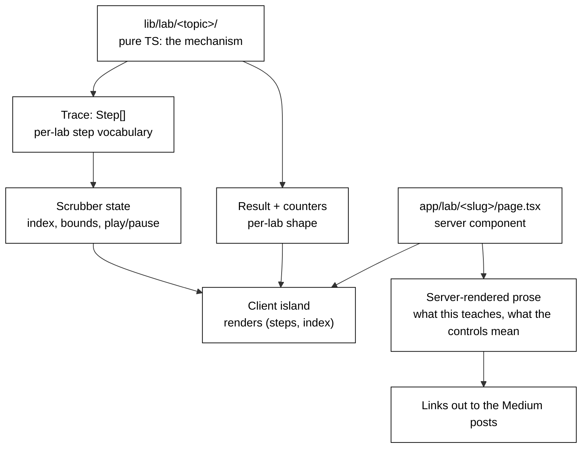

# Interactive Labs — Design Spec

**Date:** 2026-08-30
**Status:** Approved in brainstorming, pending spec review sign-off
**Scope:** A new `/lab` section of the site holding interactive explanations of the technical writing. First labs serve the Vector Databases series; the section is built to grow across other series.

## Purpose

The blog catalog holds 102 posts across 14 categories, several of which are deep multi-part series. Every one of them lives on Medium as prose. Some of what they explain is mechanism — a graph traversal, a log record climbing a hierarchy, a cache growing token by token — and mechanism is understood faster by watching it run than by reading a description of it running.

This spec introduces a place on the site where a reader can run those mechanisms. The north star is **teaching depth**: each lab exists to produce an understanding the prose cannot, not to demonstrate that the site can animate things.

## Problem

Three specific gaps motivate this:

1. **The site is a catalog, not a teacher.** Posts live on Medium; the site indexes them. Everything the site does today is navigational. There is no artifact here that teaches anything on its own.
2. **The hardest posts are the least served by prose.** "Indexing Deep Dive: HNSW, Under the Hood" describes a multi-layer greedy descent in words and a reader has to build the animation in their head. The same is true of `restart_lsn` versus `confirmed_flush_lsn` in the Postgres series, and of what actually happens when you call `logger.info()`.
3. **There is no return path from Medium.** Traffic flows out to Medium and stops. A lab that a post links into is a reason for a reader to arrive here.

## Goals

- A reader can manipulate a real implementation of a mechanism and see its internal state.
- Labs are **playgrounds, not demos**: the reader drives a mutable structure through its whole lifecycle — create, insert, search, delete, rebuild — rather than replaying a fixed animation.
- Every lab is honest about what it shows and what it distorts.
- Each lab's logic is pure TypeScript, unit-tested, and independent of how it is drawn.
- The section grows one lab at a time without a framework rewrite.

## Non-Goals

- **Not** a general-purpose visualisation framework. See "Generalisation Discipline".
- **Not** a replacement for the posts. Labs are companions; the prose remains on Medium.
- **Not** a live-data or backend feature. Everything is deterministic and client-side. No API routes, no runtime cost, no keys.

## Placement

Labs are **standalone pages under `/lab`**, one route per lab. Medium posts link into them; each lab links back out to the posts it illustrates.

The singular `/lab` is deliberate. It names a place, the way `Blog` in the nav names a place and indexes 102 posts. Experiments live in the lab.

Nothing is wired into the nav, sitemap, or command palette until a lab actually exists behind it. This follows the rule the codebase already set for itself in `components/layout/header.tsx`:

> Only linked once something is actually deployed. A nav item leading to a "COMING SOON" page advertises an absence.

## Architecture



Four layers, and the boundary that matters is the first one:

| Layer | Contains | Rule |
|---|---|---|
| `lib/lab/<topic>/` | The mechanism, as pure functions | No React import. Ever. |
| `components/lab/<topic>/` | That lab's rendering | Client component, thin |
| `components/lab/` (shared) | Whatever survives extraction | Empty until PR 5 |
| `app/lab/<slug>/` | Server page: prose, then the island | Prose is server-rendered |

### The trace shape

Every trace lab exposes pure operations. Each takes an index state and returns the next state alongside a trace of what it did:

```ts
op(state, args, params) → { state: TState, result: TResult, steps: TStep[], counters: Record<string, number> }
```

The state is threaded rather than mutated, which is what makes an undo history, a reproducible session, and a deterministic test suite all fall out of the same design. Every operation in the vector playground — `build`, `insert`, `search`, `delete`, `rebuild` — has this signature.

**`TStep` is defined per lab and is never shared.** HNSW's vocabulary (`visit`, `compare`, `descendLayer`, `prune`) and a logging trace's (`checkLevel`, `propagate`, `handlerEmit`, `filterReject`) have no overlap. A union spanning both would either grow a variant per lab — pointing the shared module's dependencies at every lab's domain, which is backwards — or collapse to `{ kind: string, label: string }`, which is stringly-typed and buys nothing a local type wouldn't.

Counters are likewise per-lab. "Bytes touched" is vector-index accounting and is meaningless to a log record.

What generalises is the *shape*, not the type: a pure function, a serialisable step array, and a UI that is a function of `(steps, index)`. Scrubber state is the one piece already known to be shareable — it needs `steps.length` and nothing else — but it is still built local to the first lab and promoted at PR 5 along with everything else that earns it. Nothing is placed in a shared directory on the strength of a prediction.

### Generalisation discipline

**`lib/lab/core` does not exist until PR 5, and its contents are an output of that PR rather than an input to this spec.**

This is the spec's own discipline, stated because the failure mode is easy and attractive: a five-archetype taxonomy was mapped across the catalog during design, and writing it down here would create pressure to build to it. Two of those shapes have a scheduled consumer; the rest are speculation. The taxonomy stays a private tool for choosing future labs and is not part of this design.

The plan instead is: build the trace machinery with one consumer (HNSW), ship it, then build a second consumer that is maximally unlike it (the logging tracer) and see what actually wants to be shared. Whatever survives that becomes `core`. Shared components — `Scoreboard`, `ParamPanel`, `PointCanvas` — are built local to the first lab and promoted in the same PR, if they earn it.

## The Vector Playground: Lifecycle

The playground is a **live index the reader owns**. Points are added by clicking the canvas, removed by clicking an existing point, queried by dragging the query marker. The same dataset can be driven through every index type, and the index can be rebuilt at any time.

Search is the least interesting operation here. What a reader cannot get from prose — and what production engineers actually get wrong — is what happens to an index **over its lifetime**.

| | Flat | IVF / IVF-PQ | HNSW |
|---|---|---|---|
| **Create** | Nothing to build | Lloyd's k-means, animated: watch centroids move and Voronoi cells settle over iterations. Codebook training for PQ. | Nothing separate — the graph *is* the insertions |
| **Insert** | Append | Assign to nearest centroid, append to that posting list. **Centroids are not retrained**, so cells drift out of balance as inserts accumulate. | Level assignment by exponential coin flip, greedy descent, bidirectional linking, neighbour-selection heuristic pruning back to `M` |
| **Search** | Scan everything | `nprobe` cells, with boundary misses visible | Layered greedy descent with `ef` |
| **Delete** | Remove | Cheap: drop from the posting list. Centroids grow stale. | **The lesson.** You cannot cleanly remove a node from a proximity graph without risking disconnection. Real systems tombstone and filter at query time. |
| **Rebuild** | — | Retrain centroids; watch imbalance resolve | Compact away tombstones and relink; watch recall and cost recover |

**Deletion is the centrepiece.** Tombstoned nodes are still traversed during search but cannot be returned, so as deletions accumulate the reader watches, on one screen: the tombstone ratio climb, distance computations per query climb with it, and recall@10 fall — then all three snap back on rebuild. That is the argument for periodic compaction, made in about fifteen seconds of interaction, and it is a thing almost nobody visualises.

It is also a content gap in the series: none of the sixteen Vector Databases posts covers deletes, tombstones, or rebuilds. The lab may well seed the post.

**Index health readout**, always visible beside the scoreboard: point count, tombstone ratio, cell balance (IVF), graph connectivity and mean degree (HNSW), and recall@10 against live brute-force ground truth. Because flat search is always available on the same data, ground truth is exact and free at these sizes.

**Undo/reset.** State is threaded, so the operation log is the undo stack. A reset button restores the seeded dataset.

## Data Honesty

Labs use seeded synthetic data. What dimension that data lives in is decided **per lab**, and the two cases pull in opposite directions.

**Trace labs compute and draw in 2D.** The subject is mechanism — which node the search visits, which cell it probes, which edge it prunes. A 768-dimensional traversal cannot be drawn, and projecting one lies about which points are near each other. 2D is the honest medium for showing *how the algorithm moves*.

**Parameter-curve labs compute in 16–64 dimensions and draw only the curve.** This is a correctness requirement, not a refinement. In 2D with a few thousand points, IVF reaches near-perfect recall at `nprobe=1` and HNSW at a trivial `ef`. A recall-versus-`ef` curve measured in 2D would be flat, and a reader would leave believing low `nprobe` is free — which is precisely the high-dimensional intuition failure that the dimensionality lab exists to demolish. Because these labs render a curve and no spatial canvas, computing in higher dimensions distorts nothing.

**The playground's 2D dataset is adversarial by construction:** tight clusters with points stranded just across cell boundaries, so IVF at low `nprobe` genuinely misses neighbours. Boundary misses are real and 2D shows them honestly. What 2D cannot show is the *rate* at which they happen.

So the tension is surfaced rather than hidden. Each spatial lab carries a line to the effect of:

> 2D shows the mechanism, not the geometry. See [the dimensionality lab] for why this intuition fails at 768 dimensions.

That converts the contradiction into the series' own lesson and a cross-link.

## Page Anatomy

Every lab page is a **server component that renders real prose**, with the interactive part as a client island below it:

1. What this lab teaches, in a paragraph.
2. What each control means and what to watch for.
3. The island.
4. Links to the Medium posts it illustrates.

The prose is not decoration. It is simultaneously the SEO answer for a page whose value is otherwise client-side JavaScript, the no-JavaScript fallback, and half of the accessibility story. A lab page whose server HTML is an empty `<div>` is not acceptable.

## Interaction and Accessibility Contract

| Concern | Decision |
|---|---|
| Scrubber | Native `<input type="range">`. Not a custom drag surface — this buys keyboard, touch, and mobile scroll behaviour in one move, and a custom scrubber is where the accessibility and mobile budget goes to die. |
| Step announcement | `aria-valuetext` on the range describing the current step ("step 12 of 40: comparing node 7, distance 0.42"), plus a polite live region for the step description. |
| Canvas | `aria-label` describing what is drawn. The scoreboard stays DOM text, never painted into the canvas. |
| Reduced motion | Manual scrubbing is inherently safe. Any autoplay or transition checks `useReducedMotion`, following the existing pattern in `components/projects/pipeline-diagram.tsx`. |
| Deep links | Search params read **on mount only** (`/lab/vector-search?index=hnsw&ef=8`), so a Medium post can link to a configured lab. No URL-state syncing. |

## Testing

TDD throughout, with one seam stated explicitly because it is where the mandate meets a hard limit.

**Fully tested, in vitest, without jsdom:** everything in `lib/lab/`. The mechanism, the step sequence, the counters, and the pure functions that compute *what to draw* — positions, highlight sets, projections, scale mapping.

**Thin and untested:** the component that calls `ctx.arc`. jsdom has no `getContext('2d')`.

The claim that "the UI is a function of `(steps, index)`" is only true if that seam is real, so the drawing component must contain no logic beyond iterating a computed draw list.

Behavioural assertions, not snapshots. For the vector labs specifically:

- IVF at `nprobe = ncells` returns exactly what flat search returns.
- HNSW recall@10 clears a threshold on the seeded dataset.
- PQ reconstruction error stays under a stated bound.
- A trace's counters match an independently computed count of comparisons.
- On the adversarial dataset, IVF at `nprobe = 1` misses at least one true neighbour — the lab's whole point, asserted.

Lifecycle assertions, which are the ones that protect the teaching claims:

- Every operation is pure: the input state is unchanged after `insert`, `delete`, and `rebuild`.
- A deleted point is never returned by search, on every index type.
- An HNSW graph stays connected across an arbitrary seeded sequence of inserts and deletes — the property whose violation is exactly why tombstoning exists.
- Search cost rises monotonically with tombstone ratio, and compaction restores both cost and recall to within a bound of the pre-deletion index.
- Inserting into IVF without retraining measurably worsens cell balance, and `rebuild` restores it.
- Replaying the operation log from the seed reproduces the identical state, which is what makes undo and shareable sessions sound.

## Registry

`config/labs.ts` — one entry per lab (slug, title, blurb, owning category, illustrated post URLs) — with the `/lab` index, sitemap entries, palette commands, and a "Labs for this series" block on category pages all deriving from it, in the manner of `lib/categories.ts`.

**It arrives with the second lab, not the first.** A registry with one entry is a list wearing a costume, and deriving pays off at n=14 categories, not at n=1 lab.

No `archetype` field until something branches on it.

A test in the style of `lib/categories.test.ts` asserts that every registry slug has a matching `app/lab/<slug>/` route folder and vice versa, since a mismatch is otherwise a silent 404.

## Dependencies

**None added.** The dependency list is currently four runtime packages and that austerity is worth keeping.

- **Charts:** inline SVG. A recall curve is roughly thirty lines. Adding a charting library would make it the largest dependency on the site.
- **Randomness:** inline mulberry32, about five lines. No `Math.random` anywhere — every visitor sees the same picture and every test is deterministic.
- **Animation:** `motion/react`, already present.

## Delivery Plan

Each row is one pull request, sized to the 500–800 LOC working band.

**PRs 1–6 are this spec's implementation scope** and are what the implementation plan should cover. PRs 7–10 are the committed roadmap: they are listed so the ordering argument is on record, but each gets its own plan once PR 6 has settled what `core` is. Planning them now would be planning against an abstraction that does not exist yet.

| # | Ships | Docs updated |
|---|---|---|
| 1 | `/lab/vector-index` shell and flat index: seeded adversarial dataset, distance metrics, threaded state with `insert` / `search` / `delete`, point canvas, scoreboard, health readout, scrubber, undo/reset, server prose. Linked from the Vector Databases category page. | README: new "Labs" section |
| 2 | IVF: seeded Lloyd's k-means with animated training, cell assignment, insert-drift, cheap delete, `nprobe` search, Voronoi rendering, rebuild. | README labs section |
| 3 | IVF-PQ: subspace codebooks, encode on insert, asymmetric distance tables, the rank scramble against exact ranking. | README labs section |
| 4 | HNSW **algorithm only**: insert (level assignment, neighbour-selection heuristic, pruning), search (layer descent, `ef`), tombstone delete, compaction. Full test suite. No UI. | — |
| 5 | HNSW **UI**: layer view, insert animation, tombstone rendering, degradation-and-compaction flow wired into the health readout. | README labs section |
| 6 | **Generalisation PR.** `config/labs.ts` + `/lab` index + nav/sitemap/palette wiring + category-page block + drift test. Extract `lib/lab/core` from what two consumers actually share, and build the `logger.info()` tracer on it. | README, and this spec amended with what `core` turned out to be |
| 7 | Dimensionality slider and memory/footprint calculator. Both parameter labs; higher-dimensional computation, curve-only rendering. | README labs section |
| 8 | Chunking visualiser (RAG). Pure DOM highlighting, no canvas. | README labs section |
| 9 | KV-cache growth tracer. Serves LLM Architectures, J-Space Primer, and AI System Design. | README labs section |
| 10 | LLM serving/VRAM calculator. | README labs section |

PR 4 and PR 5 are split deliberately. A layered HNSW with neighbour-selection heuristics, tombstoning and compaction, plus its tests, is comfortably 500+ LOC before any pixels, and combining it with the layer view is the most likely place in this plan to blow the band.

The route is `/lab/vector-index` rather than `/lab/vector-search`, because search is one of five operations it teaches.

### Ordering rationale

The first four PRs are all Vector Databases because that series is the densest and because the machinery has to be proven against a hard case before it is asked to generalise. PR 5 is the hinge: it is the first moment there are two real consumers, and therefore the first moment extraction is evidence-based rather than speculative.

The `logger.info()` tracer is second **on its own merits**, not merely as an abstraction test. `setLevel()` propagation is one of the most reliably confusing things in Python, the series carries six posts on it, and one post is titled for exactly that confusion. That it is also maximally unlike HNSW is why it is scheduled here rather than later.

The chunking visualiser is early among the non-vector labs because it is the cheapest high-value lab in the catalog — no canvas, trivially accessible, good on a phone — and it serves AI System Design, the largest category.

The serving calculator is last of the planned set and is honestly the shallowest: it is arithmetic and a table. It stays because the *breakdown* — where the memory actually goes — is the lesson of two posts in that series, and because it is the most linkable thing here. It is ordered below labs that visualise a mechanism because teaching depth is the north star.

## Cuts

Recorded so they are not silently revisited:

| Cut | Why |
|---|---|
| DiskANN lab | Its subject is the RAM/SSD boundary, which on a 2D canvas reduces to a counter labelled "SSD reads". Does not earn its cost beside HNSW. |
| Tokenizer lab | A real BPE vocabulary is a heavyweight asset, and existing tools do this better. Link out. |
| Topology/failure simulators | Shard fan-out, Kafka rebalances, replication topologies. Each is a product, not a widget — three to four PRs apiece. Revisit only after the section has proven itself. |
| Decision-matrix labs | A form with an if-tree. Low teaching depth against the north star. |
| Azure & Cloud Fundamentals, Java & Spring Boot | The two oldest series (2020–2024). The right investment there is refreshing or archiving the content, not decorating it. |
| Case Studies, AI Breakthroughs | Narrative posts. They want diagrams, not widgets. |
| Charting library | See Dependencies. |

## Manual Work Outside This Repo

**Medium backlinks.** Each lab is worth much more once the posts it illustrates link into it, and editing published Medium posts is a hand process with no pull request to track it. Without it, labs receive no traffic from the place the audience actually is.

Named here so it does not silently not happen. Each lab PR carries a corresponding manual task: add a link from every post listed in that lab's `illustrates` set.

## Open Questions

None blocking. Two to settle in flight:

1. Whether the scoreboard's recall column survives on the 2D playground or moves entirely to the curve labs. The adversarial dataset is designed to keep it meaningful; PR 2 will show whether it actually is.
2. What `lib/lab/core` contains. Deliberately unanswered — that is PR 5's job.
